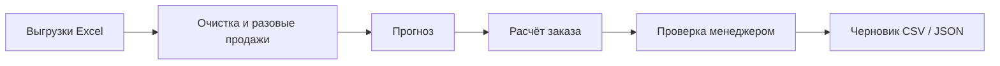

<a id="russian"></a>

# Vector — AI Procurement Copilot

**[English version ↓](#english)** · [Запуск в Docker](#docker-ru) · [Демо за 4 минуты](DEMO.md) · [Методология](#methods-ru)

**Из выгрузок продаж, остатков и поставок — в понятный черновик заказа поставщику.**

Vector помогает закупщику ответить на три вопроса: **что заказать, сколько и почему**.
Вместо ручного объединения Excel — рекомендации по каждому товару, объяснение расчёта
и проверка менеджером перед экспортом. MVP для **HackAlem AI · Электрокомплект**.

<a id="docker-ru"></a>

## Быстрый запуск для жюри и администраторов — Docker

Нужны Git и запущенный Docker Desktop в режиме **Linux containers** (Windows/macOS)
или Docker Engine (Linux). Команды одинаковы для PowerShell, bash и терминала macOS:

```bash
git clone https://github.com/BAITC-Hacks/hack-5f84cc63-vector.git
cd hack-5f84cc63-vector
docker build -t vector .
docker run --rm --name vector-demo -p 127.0.0.1:8501:8501 vector
```

Откройте **http://localhost:8501**. Контейнер запускает весь интерфейс на **40 синтетических
SKU**; Python, Excel и API-ключи на компьютере не нужны. Для первого build нужен интернет,
после сборки приложение работает без внешних API. Если репозиторий закрытый, нужен доступ к нему.

Для остановки в другом терминале:

```bash
docker stop vector-demo
```

Если порт 8501 занят, замените публикацию порта на `-p 127.0.0.1:8502:8501` и откройте
http://localhost:8502. Внутри контейнера Streamlit слушает `0.0.0.0:8501`, а приведённая
команда открывает порт только на вашем компьютере.

**Реальные Excel и `data/processed/` не нужны для демо и не входят в образ.**
Они исключены через `.dockerignore`, а Dockerfile копирует только перечисленные файлы.
Не добавляйте `data/` в GitHub: при необходимости передайте приватные материалы
администраторам отдельно по согласованному с организаторами каналу.

Проверка интерфейса на чистой копии без `data/` пройдена. **Сборка и запуск Docker
пока не проверены:** на машине разработки недоступен Docker Engine. Конфигурация
использует стандартный Linux-образ `python:3.11-slim` и не зависит от Docker Desktop
конкретного разработчика. Администратору нужно выполнить приведённые build/run команды.

## Что умеет Vector

- Выявляет кандидатов на разовые крупные продажи и исключает их из регулярного расчёта, сохраняя исходные записи.
- Прогнозирует обычные продажи с учётом сезонности и устойчивого роста, когда хватает истории.
- Оценивает упущенные продажи при наличии явных периодов отсутствия товара.
- Учитывает остаток, срок поставки и поступления с конкретными датами.
- Рассчитывает количество заказа и предупреждает, если обычная поставка придёт слишком поздно.
- Показывает составляющие расчёта и график прогнозируемого остатка.
- Позволяет проверить «что если»: изменить остаток, сроки или поставки и сразу пересчитать товар.
- Собирает черновик по поставщикам и открывает экспорт CSV/JSON после проверки менеджером.

## Как это работает



В MVP исходные выгрузки обрабатываются через Python pipeline; dashboard открывает готовые
расчёты. Загрузка Excel через интерфейс и автоматическая синхронизация с 1С пока не реализованы.

## Попробуйте за минуту

1. Откройте **«Проверка кейса» → «Открыть расчёт IEK»**: в публичном демо выбран `SYN-IEK-001`, заказ **105 шт.**
2. Во вкладке **«Что если?»** задайте остаток **55**, укажите причину и нажмите **«Пересчитать SKU»**: заказ станет **65 шт.**
3. Добавьте поступление **30 шт.** на **02.10.2026** и пересчитайте: заказ станет **35 шт.**
4. Добавьте товар в черновик, откройте **«Проверка черновика»**, укажите имя, подтвердите проверку и скачайте CSV.

Срок поставки в этом примере — 3 дня, период пересмотра — 7, страховой запас — 2 дня.
Все числа этого примера **синтетические**. [Полный сценарий защиты →](DEMO.md)

### Два режима данных

| Режим | Данные | Что увидит пользователь |
|---|---|---|
| Публичное демо | 40 синтетических товарных рядов IEK и SystemElectric, около 305 КиБ в `demo/` | Полный сценарий расчёта, изменения, проверки и экспорта с маркировкой демоданных |
| Локальные данные | Готовые расчёты в `data/processed/` на предоставленных выгрузках | Реальные продажи; неподтверждённые остатки и сроки явно обозначены как сценарные допущения |

Приложение выбирает локальные расчёты, если они есть; иначе автоматически открывает `demo/`.
**В GitHub публикуется `demo/`. Файлы партнёра и `data/processed/` остаются локально.**

<a id="quickstart-ru"></a>

## Запуск без Docker

Из корня репозитория, в Python 3.11+ (проверено на 3.14):

```bash
pip install -e ".[dashboard]"
streamlit run app.py
```

Откройте **http://localhost:8501**. Исходные Excel и API-ключи для демо не нужны.
Интерфейс по умолчанию русский; переключатель **RU / EN** находится слева.
Смена языка сохраняет сценарий, черновик и отметку о проверке.

Основной способ передачи MVP — локальный Docker. Публичный деплой не выполняется.

<details>
<summary>Администратору: подключить существующие приватные данные локально</summary>

Если в локальной папке `data/` уже есть готовые расчёты `processed/`, её можно подключить
только для чтения. Команду запускайте из корня проекта:

```bash
docker run --rm --name vector-private -p 127.0.0.1:8501:8501 --mount "type=bind,source=${PWD}/data,target=/app/data,readonly" vector
```

Данные подключаются при запуске и не встраиваются в образ. Одних Excel недостаточно:
сначала нужен [pipeline](docs/ARCHITECTURE.md#private-pipeline-commands). Полная проверка
частных доказательств требует совпадения исходных файлов, кода и сохранённого отчёта;
без них рекомендации доступны, но экран доказательств может сообщить об устаревшем отчёте.

</details>

<a id="methods-ru"></a>

## Откуда берётся количество заказа

1. **Очистка.** Объём документа сравнивается с предыдущими продажами того же товара,
   склада и единицы измерения. Медиана и устойчивые статистические пороги помогают
   выявлять всплески; повторяющиеся крупные заказы учитываются отдельно. При малой истории
   продажа сохраняется. Исходные значения не удаляются, отрицательные не превращаются в положительные.
2. **Прогноз.** Простые модели сравниваются на прошлых периодах; последний контрольный период
   не участвует в выборе модели. Сезонность и рост входят в прогноз. При наличии периодов
   отсутствия товара история корректируется перед пересчётом прогноза.
3. **Заказ.** Прогноз на срок поставки и период пересмотра + страховой запас − доступный
   остаток − подходящие по датам поступления. Дополнительно проверяется дефицит между
   поставками и применяются определённые ограничения партии и округления.

Сезонность, рост и компенсация отсутствия товара **не добавляются к заказу повторно**.
Если дефицит наступает раньше новой поставки, Vector предлагает ускорение или перемещение.
Количество рассчитывает алгоритм; LLM в текущем MVP не подключён.

## Пять требований — пять доказательств

Все примеры доступны на экране **«Проверка кейса»**.

| Требование | Результат | Доказательство и границы |
|---|---|---|
| Базовое пополнение | Частично | В синтетическом демо остаток и поставка меняют заказ **105 → 65 → 35**. Категории и применимость внешних коэффициентов не подтверждены. |
| Сезонность и рост | Пройдено на синтетике | На 36 месяцах восстанавливаются сезонный рисунок и рост **+5 ед./месяц**. |
| Упущенные продажи | Пройдено на синтетике | Коррекция повышает заказ **67 → 104**. Реальные периоды отсутствия товара не предоставлены. |
| Разовый крупный заказ | Частично | Вставка **9 000 ед.** оставляет очищенный заказ **63**, вместо **1 224** без очистки. Анализ по клиенту ещё не реализован; нет обезличенных ID клиентов. |
| Объяснение и проверка по поставщикам | Пройдено для MVP | Ручное изменение с причиной → проверка → CSV/JSON. Изменение расчёта отменяет прежнюю проверку. |

## Статус и ограничения

Рабочий MVP с воспроизводимым расчётом и интерфейсом. На частных данных прогноз сформирован
для **992 из 2 716** товарных рядов; остальные требуют уточнения истории или её качества.
Пробелы видны в **«Качестве данных»** и не подменяются нулями.

Реальные текущие остатки, сроки поставщиков и периоды отсутствия товара не подтверждены.
Нет доказанного снижения затрат; прогноз не превосходит базовую модель во всех сегментах.
Экспорт — CSV/JSON, совместимость с конкретным шаблоном 1С ещё не проверена.
Заказы не отправляются поставщикам. Проверка действует в текущем сеансе и не заменяет
корпоративную авторизацию; черновик нужно скачать до завершения сеанса.

## Подробнее

[Сценарий защиты](DEMO.md) · [Кейс](docs/CASE.md) · [Архитектура и команды](docs/ARCHITECTURE.md#private-pipeline-commands)
· [Очистка и выбросы](docs/DEMAND_POLICY.md) · [Прогнозирование](docs/FORECAST_POLICY.md)
· [Заказ и stockout](docs/REPLENISHMENT_POLICY.md) · [Факты о данных](docs/DATA_FINDINGS.md)
· [Открытые вопросы](docs/OPEN_QUESTIONS.md).

---

<a id="english"></a>

## English

**[Русская версия ↑](#russian)** · [Four-minute demo](DEMO.md)

**Turn sales, inventory and incoming-supply exports into an explained supplier order draft.**

Vector helps purchasing managers decide **what to order, how much and why**.
It replaces manual spreadsheet consolidation with per-item recommendations, transparent
calculations and manager review before export. Built for **HackAlem AI · Electrokomplekt**.

### Quick start for jury and administrators — Docker

Install Git and start Docker Desktop in **Linux containers** mode (Windows/macOS), or
Docker Engine (Linux). Run in PowerShell, bash or the macOS terminal:

```bash
git clone https://github.com/BAITC-Hacks/hack-5f84cc63-vector.git
cd hack-5f84cc63-vector
docker build -t vector .
docker run --rm --name vector-demo -p 127.0.0.1:8501:8501 vector
```

Open **http://localhost:8501**. The full interface starts with **40 synthetic SKU series**.
No host Python, private workbooks or API keys are needed. The first build downloads
dependencies; the built app uses no external APIs. Private repository access may be required.
Stop it from another terminal with `docker stop vector-demo`.

If port 8501 is busy, use `-p 127.0.0.1:8502:8501` and open http://localhost:8502.
Streamlit listens on `0.0.0.0:8501` inside the container; the example publishes it only
on the local computer. **Partner Excel and `data/processed/` never enter the image:**
`.dockerignore` excludes them and Dockerfile copies only explicitly listed files.
Keep private data out of GitHub; share it separately through an organizer-approved channel if needed.

The interface passes a clean-copy check without `data/`. **Docker build/run are not yet
verified:** the development machine's Docker Engine was unavailable. The Dockerfile
uses the standard Linux `python:3.11-slim` image without developer-specific settings;
the administrator should run the build/run commands above.

### What Vector does

- Flags candidate one-off bulk sales and excludes them from regular calculations while retaining the original records.
- Forecasts regular sales, including seasonality and sustained growth where history supports them.
- Estimates missing sales when explicit stockout intervals are available.
- Accounts for available stock, supplier lead times and dated incoming receipts.
- Calculates order quantities and warns when normal delivery would arrive too late.
- Explains calculation components and charts projected inventory.
- Recalculates what-if scenarios for stock, lead times and incoming supply.
- Groups drafts by supplier and enables CSV/JSON export after manager review.

### How it works

```text
Excel exports → Cleaning and one-off detection → Forecast
→ Replenishment calculation → Manager review → CSV / JSON draft
```

The MVP processes supplied exports through a Python pipeline; the dashboard consumes
prepared calculations. UI Excel upload and scheduled 1C synchronization are not implemented.

### Try it in one minute

1. Select **EN**, then **Case validation → Open IEK calculation**: public SKU `SYN-IEK-001` recommends **105 units**.
2. In **What-if scenario**, set available stock to **55**, enter a reason and recalculate: **65 units**.
3. Add an incoming receipt of **30 units** on **2026-10-02** and recalculate: **35 units**.
4. Add the item to the draft, open **Draft review**, enter a reviewer name, acknowledge and download the reviewed CSV.

Keep lead time at 3 days, review period at 7 and safety at 2. These figures are
**synthetic**, not partner purchasing needs. [Full jury walkthrough →](DEMO.md)

### Demo data and local startup

| Mode | Data | Behaviour |
|---|---|---|
| Public demo | 40 generated SKU series across IEK and SystemElectric; about 305 KiB in `demo/` | Complete scenario, review and export workflow with explicit synthetic labels |
| Private local data | Prepared runs in `data/processed/` based on supplied exports | Real observed sales; unconfirmed operational inputs remain labeled scenario assumptions |

Private completed runs take priority. Without them, the app automatically opens the bundled
demo. **Commit `demo/`; keep partner Excel and private processed data out of GitHub.**

From the repository root, using Python 3.11+ (checked on 3.14):

```bash
pip install -e ".[dashboard]"
streamlit run app.py
```

Open **http://localhost:8501**. Demo mode needs no private workbooks or API keys.
Russian is the default; **RU / EN** preserves scenarios, drafts and recorded review.

Local Docker is the primary handoff; no public deployment is performed.

<details>
<summary>Administrator: mount existing private data locally</summary>

If `data/` already contains prepared `processed/` runs, launch from the repository root:

```bash
docker run --rm --name vector-private -p 127.0.0.1:8501:8501 --mount "type=bind,source=${PWD}/data,target=/app/data,readonly" vector
```

This read-only runtime mount does not embed data in the image. Raw Excel alone is
insufficient: first run the [pipeline](docs/ARCHITECTURE.md#private-pipeline-commands).
Private acceptance evidence also requires matching source files, code and saved reports;
otherwise recommendations can load while the evidence page reports a stale snapshot.

</details>

### How quantities are calculated

1. **Clean observed sales.** Compare each document with earlier sales for the same SKU,
   warehouse and unit using median-based robust thresholds. Recognize recurring large
   orders and preserve sparse-history sales. Keep original values; never turn negative
   quantities positive automatically.
2. **Forecast.** Compare simple models on rolling historical periods, keeping the final
   holdout out of model selection. Seasonality and growth are forecast components.
   Explicit stockout intervals can correct history before refitting the forecast.
3. **Replenish.** Forecast over lead time plus review period + safety stock − available
   stock − qualifying dated receipts. Check shortages between receipts, then apply
   resolved order constraints and rounding.

Seasonality, growth and stockout recovery are not added to the order a second time.
Shortages before a new order arrives require expedited supply or a transfer. Quantities
come from deterministic calculations; the current MVP has no LLM integration.

### Five requirements, five proofs

All examples are available on the **Case validation** page.

| Requirement | Result | Evidence and boundary |
|---|---|---|
| Base replenishment | PARTIAL | Synthetic stock and receipt changes produce **105 → 65 → 35**. Categories and external coefficient applicability remain unresolved. |
| Seasonality and growth | PASS, synthetic | A generated 36-month series recovers the annual pattern and **+5 units/month** growth. |
| Stockout compensation | PASS, synthetic | Correction raises the order **67 → 104**. Real stockout intervals were not supplied. |
| One-off protection | PARTIAL | Injecting **9,000 units** leaves the cleaned order at **63**, versus **1,224** without cleaning. Customer grouping is not implemented; anonymized customer IDs are absent. |
| Explained supplier-grouped review | PASS for MVP | Reasoned manual adjustment → review → CSV/JSON. Scenario edits invalidate the previous review. |

### Status and limitations

Working MVP with reproducible calculations and a bilingual interface. The private dataset
supports forecasts for **992 of 2,716** observed series; the remainder require history or
data-quality resolution. **Data coverage** exposes gaps without inventing values.

Current partner stock, supplier times and real stockout intervals are unconfirmed.
No inventory-cost reduction has been established, and the forecast does not beat the
baseline in every segment. Export is CSV/JSON; exact 1C import compatibility is unverified.
Nothing is sent to suppliers. Review is a session acknowledgement, not corporate
authorization; download the draft before ending the session.

### Technical documentation

[Demo script](DEMO.md) · [Case](docs/CASE.md) · [Architecture and commands](docs/ARCHITECTURE.md#private-pipeline-commands)
· [Demand cleaning](docs/DEMAND_POLICY.md) · [Forecast methodology](docs/FORECAST_POLICY.md)
· [Replenishment and stockout](docs/REPLENISHMENT_POLICY.md) · [Data findings](docs/DATA_FINDINGS.md)
· [Open questions](docs/OPEN_QUESTIONS.md).
